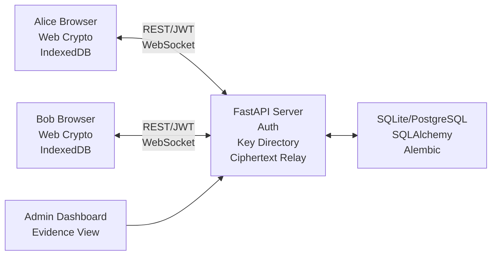

# NGHIÊN CỨU VÀ TRIỂN KHAI HỆ THỐNG NHẮN TIN WEB MÃ HÓA ĐẦU CUỐI DỰA TRÊN JWT, PRE-KEY VÀ WEB CRYPTO

Ngày cập nhật: 01/07/2026

Môn học: Mật mã ứng dụng

Đơn vị: Ho Chi Minh City University of Technology and Engineering (HCM-UTE)

Nhóm thực hiện:

| Thành viên | GitHub | Vai trò chính |
|---|---|---|
| Ly Van Huu Hoa | hoalvh | Application security, authentication, backend relay, Security Lab backend |
| Le Quang Minh | hnhat1234 | E2EE protocol, key schedule, ratchet, protocol testing |
| Tran Quoc Truong | siberlly | Frontend security UX, client state, admin/demo UI |

---

## TÓM TẮT

Bài nghiên cứu trình bày quá trình khảo sát, thiết kế, triển khai và đánh giá một hệ thống nhắn tin web một-một có mã hóa đầu cuối. Vấn đề chính được đặt ra là: nếu ứng dụng chat chỉ dựa vào HTTPS/TLS thì dữ liệu được bảo vệ trên đường truyền, nhưng server vẫn có thể xử lý và lưu plaintext. Vì vậy, đề tài xây dựng một kiến trúc crypto-first, trong đó server chỉ đảm nhiệm xác thực, quản lý khóa công khai, chuyển tiếp/lưu ciphertext và cung cấp bằng chứng kiểm tra; còn private key, session key và thao tác mã hóa/giải mã nằm ở trình duyệt người dùng.

Hệ thống được triển khai bằng FastAPI, SQLAlchemy, SQLite/PostgreSQL, HTML/CSS/vanilla JavaScript và Web Crypto API. Cơ chế xác thực dùng Argon2id password hashing, JWT HMAC-SHA256 và refresh token qua HttpOnly cookie. Cơ chế mã hóa sử dụng ECDH P-256, ECDSA P-256, HKDF-SHA256 và AES-GCM. Trình duyệt tạo identity signing key, device identity key, signed pre-key, one-time pre-key và dynamic session state trong IndexedDB. Khi gửi tin nhắn, client thiết lập phiên theo hướng X3DH-style, sinh per-message key và mã hóa nội dung trước khi gửi server.

Kết quả kiểm thử trên repo hiện tại cho thấy backend đạt `17 passed, 1 warning`; kiểm tra cú pháp JavaScript cho `apps/web/src/app.js` và `scripts/decrypt_message.mjs` đều thành công. Bài nghiên cứu cũng so sánh hệ thống với các mô hình TLS-only chat, server-side encryption, static ECDH demo và Signal/Messenger-style production. Kết luận chính: prototype đáp ứng mục tiêu môn học về tách biệt xác thực server và bảo mật nội dung, nhưng chưa phải secure messenger production vì chưa có full Double Ratchet, skipped-message keys, key transparency, multi-device fan-out và key recovery.

Từ khóa: mã hóa đầu cuối, JWT, Argon2id, ECDH P-256, ECDSA P-256, HKDF-SHA256, AES-GCM, Web Crypto API, IndexedDB, signed pre-key, one-time pre-key, FastAPI.

---

## ABSTRACT

This paper presents the design, implementation, and evaluation of a browser-based one-to-one secure web chat prototype for an Applied Cryptography course. The research addresses a common limitation of TLS-only chat systems: transport encryption protects network traffic, but the server can still access plaintext after request processing. The proposed architecture separates authentication from message confidentiality. The FastAPI server handles account authentication, public-key directory, ciphertext relay/storage, and audit evidence, while the browser remains responsible for private keys, session key derivation, encryption, and decryption.

The prototype uses Argon2id for password hashing, HMAC-SHA256 JWTs for API authorization, HttpOnly refresh-token cookies, ECDH/ECDSA P-256, HKDF-SHA256, and AES-GCM through the Web Crypto API. A Signal-inspired pre-key session setup is implemented with identity signing keys, signed pre-keys, one-time pre-keys, sender ephemeral keys, and local IndexedDB session state. Experiments verify that the server stores only hashes, public keys, ciphertext, nonce, tag, and metadata, while plaintext and private key material remain client-side. The system is suitable as a course prototype, but it is not a complete Signal implementation.

---

## MỤC LỤC CHI TIẾT

**CHƯƠNG 1: TỔNG QUAN NGHIÊN CỨU**

1.1. Lý do chọn đề tài

1.2. Vấn đề nghiên cứu

1.3. Mục tiêu nghiên cứu

1.4. Phạm vi nghiên cứu

1.5. Câu hỏi nghiên cứu

1.6. Phương pháp nghiên cứu

1.7. Đóng góp của đề tài

1.8. Bố cục báo cáo

**CHƯƠNG 2: CƠ SỞ LÝ THUYẾT VÀ CÁC THÀNH PHẦN MẬT MÃ**

2.1. Mã hóa đầu cuối

2.1.1. Định nghĩa

2.1.2. Cách hoạt động

2.1.3. Ưu điểm

2.1.4. Nhược điểm

2.1.5. Liên hệ với đề tài

2.2. Xác thực JWT và refresh token

2.2.1. Định nghĩa

2.2.2. Cách hoạt động

2.2.3. Ưu điểm

2.2.4. Nhược điểm

2.2.5. Liên hệ với đề tài

2.3. Hàm băm mật khẩu Argon2id

2.3.1. Định nghĩa

2.3.2. Cách hoạt động

2.3.3. Ưu điểm

2.3.4. Nhược điểm

2.3.5. Liên hệ với đề tài

2.4. Thuật toán trao đổi khóa ECDH P-256

2.4.1. Định nghĩa

2.4.2. Cách hoạt động

2.4.3. Ưu điểm

2.4.4. Nhược điểm

2.4.5. Liên hệ với đề tài

2.5. Chữ ký số ECDSA P-256

2.5.1. Định nghĩa

2.5.2. Cách hoạt động

2.5.3. Ưu điểm

2.5.4. Nhược điểm

2.5.5. Liên hệ với đề tài

2.6. Hàm dẫn xuất khóa HKDF-SHA256

2.6.1. Định nghĩa

2.6.2. Cách hoạt động

2.6.3. Ưu điểm

2.6.4. Nhược điểm

2.6.5. Liên hệ với đề tài

2.7. Thuật toán mã hóa AES-GCM

2.7.1. Định nghĩa

2.7.2. Cách hoạt động

2.7.3. Ưu điểm

2.7.4. Nhược điểm

2.7.5. Liên hệ với đề tài

2.8. Pre-key, X3DH-style setup và ratchet

2.8.1. Định nghĩa

2.8.2. Cách hoạt động

2.8.3. Ưu điểm

2.8.4. Nhược điểm

2.8.5. Liên hệ với đề tài

**CHƯƠNG 3: PHÂN TÍCH VÀ THIẾT KẾ HỆ THỐNG**

3.1. Yêu cầu chức năng

3.2. Yêu cầu phi chức năng

3.3. Mô hình đe dọa

3.4. Kiến trúc tổng thể

3.5. Thiết kế cơ sở dữ liệu

3.6. Thiết kế API

3.7. Thiết kế gói tin mã hóa

3.8. Thiết kế cơ chế lưu trữ tin nhắn

**CHƯƠNG 4: TRIỂN KHAI SẢN PHẨM**

4.1. Môi trường và công nghệ sử dụng

4.2. Triển khai backend

4.3. Triển khai frontend

4.4. Luồng gửi tin nhắn

4.5. Luồng nhận tin nhắn

4.6. Admin dashboard

4.7. Hướng dẫn chạy local

**CHƯƠNG 5: THỰC NGHIỆM, SO SÁNH VÀ ĐÁNH GIÁ**

5.1. Môi trường thực nghiệm

5.2. Kịch bản kiểm thử

5.3. Kết quả kiểm thử

5.4. Tiêu chí so sánh

5.5. So sánh với các mô hình nhắn tin khác

5.6. So sánh lựa chọn thuật toán

5.7. Đánh giá tổng quan

**CHƯƠNG 6: KẾT LUẬN VÀ HƯỚNG PHÁT TRIỂN**

6.1. Kết luận

6.2. Hạn chế

6.3. Hướng phát triển

**PHỤ LỤC**

A. Kịch bản demo

B. Câu hỏi bảo vệ

C. Code pointer

D. Tài liệu tham khảo

---

# CHƯƠNG 1: TỔNG QUAN NGHIÊN CỨU

## 1.1. Lý Do Chọn Đề Tài

Ứng dụng nhắn tin là một trong những môi trường phổ biến nhất để áp dụng mật mã trong đời sống thực tế. Người dùng không chỉ cần gửi và nhận tin nhắn nhanh, mà còn cần bảo vệ nội dung trao đổi khỏi bên thứ ba, khỏi người vận hành server và khỏi trường hợp database bị rò rỉ. Nếu một hệ thống chat chỉ sử dụng HTTPS/TLS, dữ liệu được bảo vệ trên đường truyền, nhưng sau khi request đến server thì server vẫn có thể đọc, xử lý hoặc lưu plaintext.

Vì vậy, đề tài chọn hướng nghiên cứu mã hóa đầu cuối cho hệ thống chat web. Điểm quan trọng của hướng này là tách bạch giữa xác thực người dùng và bảo mật nội dung. Server vẫn có vai trò quan trọng trong đăng ký, đăng nhập, định tuyến, lưu khóa công khai và chuyển tiếp tin nhắn, nhưng không được nắm giữ khóa để giải mã nội dung tin nhắn.

## 1.2. Vấn Đề Nghiên Cứu

Vấn đề nghiên cứu có thể phát biểu như sau:

```text
Làm thế nào xây dựng một hệ thống chat web mà server vẫn xác thực và chuyển tiếp được tin nhắn,
nhưng không thể đọc plaintext, không lưu private key và không giữ message key?
```

Vấn đề này kéo theo nhiều câu hỏi kỹ thuật: token xác thực có liên quan gì đến mã hóa tin nhắn, khóa riêng lưu ở đâu, message key được sinh như thế nào, server cần validate packet ra sao, và làm sao chứng minh server chỉ thấy ciphertext.

## 1.3. Mục Tiêu Nghiên Cứu

Mục tiêu tổng quát là xây dựng một prototype nhắn tin web mã hóa đầu cuối có thể chạy được, giải thích được và kiểm thử được trong phạm vi môn Mật mã ứng dụng.

Các mục tiêu cụ thể:

| Mã | Mục tiêu |
|---|---|
| G1 | Xác thực người dùng bằng password hash, JWT và refresh token |
| G2 | Sinh private key ở browser và không gửi private key lên server |
| G3 | Thiết lập session mã hóa bằng ECDH/HKDF theo hướng pre-key |
| G4 | Mã hóa tin nhắn bằng AES-GCM trước khi gửi server |
| G5 | Server chỉ relay/lưu ciphertext, nonce, tag và metadata |
| G6 | Admin dashboard chứng minh server không có plaintext |
| G7 | Backend từ chối plaintext, private key material và sender spoofing |
| G8 | Có kiểm thử backend để xác minh các boundary bảo mật |

## 1.4. Phạm Vi Nghiên Cứu

Phạm vi triển khai:

- chat một-một giữa hai user;
- đăng ký, đăng nhập, đăng xuất;
- password hashing bằng Argon2id;
- access JWT và refresh token qua HttpOnly cookie;
- tạo device key trong browser bằng Web Crypto API;
- lưu private key, pre-key private material và session state trong IndexedDB;
- public key directory trên server;
- identity signing key, signed pre-key và one-time pre-key;
- X3DH-style session setup ở mức prototype;
- HKDF-SHA256 session/message key derivation;
- AES-GCM encryption với canonical header làm associated data;
- relay-only khi người nhận online và ciphertext-only offline queue khi cần;
- admin dashboard và Security Lab endpoints;
- backend tests và script kiểm tra cú pháp.

Ngoài phạm vi hiện tại:

- full Signal Protocol;
- full Double Ratchet với skipped-message keys;
- key transparency production-grade;
- encrypted key backup/recovery;
- multi-device fan-out;
- group messaging;
- file/media encryption;
- mobile app;
- deployment/CI/CD/monitoring production.

## 1.5. Câu Hỏi Nghiên Cứu

| Mã | Câu hỏi nghiên cứu |
|---|---|
| RQ1 | Làm thế nào để dùng JWT cho xác thực API mà không biến JWT thành cơ chế bảo mật nội dung? |
| RQ2 | Làm thế nào để server hỗ trợ public-key directory và offline queue nhưng không giữ plaintext/private key/message key? |
| RQ3 | Mô hình pre-key trong browser có thể được triển khai bằng Web Crypto API như thế nào? |
| RQ4 | Backend cần kiểm tra những gì để bảo vệ ranh giới giữa dữ liệu mã hóa và dữ liệu rõ? |
| RQ5 | Khi so với TLS-only, server-side encryption, static ECDH và Signal/Messenger-style E2EE, prototype hiện tại mạnh/yếu ở đâu? |

## 1.6. Phương Pháp Nghiên Cứu

Đề tài sử dụng phương pháp nghiên cứu thực nghiệm thông qua xây dựng prototype. Thay vì chỉ trình bày lý thuyết, nhóm triển khai một sản phẩm có backend, frontend, database, admin dashboard và test suite. Mỗi khẳng định bảo mật chính được đối chiếu với code hoặc kiểm thử.

Quy trình nghiên cứu:

1. Xác định mô hình đe dọa.
2. Chọn các primitive mật mã phù hợp với môi trường web.
3. Thiết kế kiến trúc tách server authentication và client-side E2EE.
4. Triển khai backend auth, key directory, relay/storage và admin evidence.
5. Triển khai frontend crypto bằng Web Crypto API.
6. Viết test cho các boundary bảo mật.
7. So sánh với các mô hình nhắn tin khác.
8. Ghi nhận hạn chế và hướng phát triển.

## 1.7. Đóng Góp Của Đề Tài

Đóng góp của đề tài gồm:

- một prototype secure web chat có thể chạy local;
- kiến trúc client-first E2EE, trong đó browser giữ khóa và server chỉ relay/lưu ciphertext;
- mô hình pre-key session setup phục vụ giảng dạy;
- storage mode `auto`, `never`, `always` giúp so sánh relay-only và offline queue;
- admin dashboard để chứng minh server-side evidence;
- test suite xác nhận plaintext rejection, private key rejection, admin authorization, pre-key/OTP và database integrity;
- báo cáo phân biệt rõ phần đã triển khai và phần chưa phải production.

## 1.8. Bố Cục Báo Cáo

Báo cáo gồm sáu chương chính. Chương 1 trình bày tổng quan nghiên cứu. Chương 2 trình bày cơ sở lý thuyết và các thành phần mật mã. Chương 3 phân tích và thiết kế hệ thống. Chương 4 mô tả triển khai sản phẩm. Chương 5 trình bày thực nghiệm, so sánh và đánh giá. Chương 6 kết luận và định hướng phát triển.

---

# CHƯƠNG 2: CƠ SỞ LÝ THUYẾT VÀ CÁC THÀNH PHẦN MẬT MÃ

## 2.1. Mã Hóa Đầu Cuối

### 2.1.1. Định nghĩa

Mã hóa đầu cuối là mô hình bảo mật trong đó nội dung chỉ được giải mã tại hai endpoint hợp lệ: thiết bị người gửi và thiết bị người nhận. Server có thể định tuyến, lưu trữ bản mã và quản lý tài khoản, nhưng không có khóa để đọc nội dung.

### 2.1.2. Cách hoạt động

Trong một hệ thống E2EE, client người gửi mã hóa plaintext thành ciphertext trước khi gửi lên server. Server nhận ciphertext và chuyển tiếp cho người nhận. Client người nhận sử dụng khóa riêng hoặc khóa phiên đã thỏa thuận để giải mã ciphertext thành plaintext.

Luồng khái quát:

```text
Plaintext ở Alice
-> Alice browser mã hóa
-> Server nhận ciphertext
-> Bob browser nhận ciphertext
-> Bob browser giải mã local
```

### 2.1.3. Ưu điểm

- Server compromise không tự động làm lộ nội dung.
- Admin hoặc người vận hành server không đọc được tin nhắn.
- Phù hợp với yêu cầu bảo vệ quyền riêng tư.
- Tách rõ lớp xác thực và lớp bảo mật nội dung.

### 2.1.4. Nhược điểm

- Khó triển khai hơn chat thông thường.
- Nếu client bị XSS/malware thì private key có thể bị lộ.
- Khó hỗ trợ tìm kiếm server-side, backup, multi-device và recovery.
- Cần cơ chế xác minh khóa để giảm nguy cơ server tráo public key.

### 2.1.5. Liên hệ với đề tài

Trong đề tài, E2EE được triển khai trong `apps/web/src/app.js`. Server FastAPI chỉ nhận encrypted packet gồm header, nonce, ciphertext và tag. Admin dashboard dùng để chứng minh server không có plaintext.

## 2.2. Xác Thực JWT Và Refresh Token

### 2.2.1. Định nghĩa

JWT là token dạng compact dùng để biểu diễn claim về một user hoặc một phiên truy cập. Trong đề tài, JWT dùng để xác thực API request, không dùng để mã hóa tin nhắn.

Refresh token là token dài hạn hơn dùng để cấp lại access token. Refresh token được đặt trong HttpOnly cookie để JavaScript không đọc trực tiếp được.

### 2.2.2. Cách hoạt động

Luồng xác thực:

```text
User nhập username/password
-> Server verify password
-> Server cấp access JWT
-> Server tạo refresh token
-> Browser gọi API bằng Authorization: Bearer <JWT>
-> Khi JWT hết hạn, browser dùng refresh cookie để xin token mới
```

JWT trong hệ thống có các trường như `sub`, `username`, `session_id`, `jti`, `iat`, `exp`, `iss`, `aud` và chữ ký HMAC-SHA256.

### 2.2.3. Ưu điểm

- Dễ tích hợp với REST API.
- Server có thể xác thực request nhanh.
- Access token ngắn hạn giúp giảm thời gian token bị lạm dụng.
- Refresh token qua HttpOnly cookie giảm nguy cơ JavaScript đọc token dài hạn.

### 2.2.4. Nhược điểm

- Nếu JWT bị đánh cắp, attacker có thể gọi API trong thời gian token còn hiệu lực.
- JWT không tự thu hồi dễ như session server-side nếu không có cơ chế bổ sung.
- Hand-written JWT không nên dùng cho production; nên dùng thư viện chuẩn.

### 2.2.5. Liên hệ với đề tài

JWT chỉ trả lời câu hỏi "ai được gọi API?". JWT không chứa private key, session root key hay message key. Vì vậy, JWT không giải mã được tin nhắn. Các hàm liên quan nằm trong `apps/server/main.py`: `sign_jwt`, `verify_jwt`, `issue_tokens`.

## 2.3. Hàm Băm Mật Khẩu Argon2id

### 2.3.1. Định nghĩa

Argon2id là password hashing algorithm được thiết kế để chống brute force và tăng chi phí tấn công bằng cách sử dụng cả thời gian tính toán và bộ nhớ. Đây là lựa chọn phù hợp hơn so với các hash nhanh như SHA-256 khi lưu mật khẩu.

### 2.3.2. Cách hoạt động

Khi user đăng ký, server không lưu password gốc. Server tạo hash từ password và lưu hash vào database. Khi user đăng nhập, server hash password nhập vào theo tham số tương ứng và so sánh với hash đã lưu.

```text
password
-> Argon2id(password, salt, cost)
-> password_hash
-> lưu vào users table
```

### 2.3.3. Ưu điểm

- Chống brute force tốt hơn hash nhanh.
- Có tham số chi phí tính toán và bộ nhớ.
- Phù hợp cho password storage.

### 2.3.4. Nhược điểm

- Tốn tài nguyên hơn các hash nhanh.
- Cần cấu hình cost phù hợp với môi trường triển khai.
- Nếu password yếu, hash mạnh vẫn không loại bỏ hoàn toàn rủi ro dò mật khẩu.

### 2.3.5. Liên hệ với đề tài

Backend dùng password hashing khi register/login. Admin dashboard chỉ hiển thị password hash, không hiển thị password gốc. Điều này hỗ trợ mục tiêu server compromise không làm lộ password rõ.

## 2.4. Thuật Toán Trao Đổi Khóa ECDH P-256

### 2.4.1. Định nghĩa

ECDH là cơ chế trao đổi khóa dựa trên elliptic curve Diffie-Hellman. Hai bên dùng private key của mình và public key của đối phương để tính ra shared secret giống nhau mà không truyền secret đó qua mạng.

### 2.4.2. Cách hoạt động

Ở mức khái quát:

```text
Alice private key + Bob public key -> shared secret
Bob private key + Alice public key -> same shared secret
```

Trong đề tài, shared secret không dùng trực tiếp làm AES key. Nó được đưa vào HKDF-SHA256 để dẫn xuất root key, chain key và message key.

### 2.4.3. Ưu điểm

- Cho phép thỏa thuận secret qua kênh không tin cậy.
- Public key có thể lưu trên server.
- P-256 được Web Crypto API hỗ trợ rộng rãi.

### 2.4.4. Nhược điểm

- Cần xác thực public key để tránh man-in-the-middle.
- Nếu private key client bị lộ, các phiên phụ thuộc vào khóa đó bị ảnh hưởng.
- P-256 không phải lựa chọn phổ biến nhất trong Signal production, nơi thường dùng X25519.

### 2.4.5. Liên hệ với đề tài

Browser tạo ECDH P-256 device key trong `ensureDevice`. Session setup dùng nhiều phép ECDH trong `computeX3dhRootKey` và `decryptPacket`.

## 2.5. Chữ Ký Số ECDSA P-256

### 2.5.1. Định nghĩa

ECDSA là thuật toán chữ ký số dựa trên elliptic curve. Nó cho phép một bên ký dữ liệu bằng private signing key, và bên khác kiểm tra chữ ký bằng public signing key.

### 2.5.2. Cách hoạt động

Trong đề tài:

```text
identity private signing key
-> ký device key / signed pre-key / one-time pre-key
-> server lưu public material + signature
-> client khác dùng identity public key để verify
```

### 2.5.3. Ưu điểm

- Giúp ràng buộc public key với identity.
- Giảm nguy cơ key bundle bị sửa âm thầm.
- Web Crypto API hỗ trợ P-256.

### 2.5.4. Nhược điểm

- Chưa giải quyết hoàn toàn trust on first use.
- Nếu identity key lần đầu đã bị tráo, signature vẫn có thể hợp lệ theo identity giả.
- Cần key transparency hoặc safety number để tăng bảo vệ trong production.

### 2.5.5. Liên hệ với đề tài

Frontend có các hàm `ensureIdentityKey`, `signWithIdentityKey`, `verifyEcdsaSignature`. Public signing key và signature được dùng để kiểm tra device/pre-key bundle.

## 2.6. Hàm Dẫn Xuất Khóa HKDF-SHA256

### 2.6.1. Định nghĩa

HKDF là Key Derivation Function dùng để sinh các khóa con từ một secret ban đầu. HKDF-SHA256 sử dụng SHA-256 làm hàm băm bên trong.

### 2.6.2. Cách hoạt động

HKDF nhận input secret, salt và info label để sinh output keying material.

Trong đề tài:

```text
DH outputs
-> HKDF-SHA256(info="x3dh-root")
-> root key
-> HKDF-SHA256(info="session-chain:v3:...")
-> chain key
-> HKDF-SHA256(info="session-message-key:n")
-> message key
```

### 2.6.3. Ưu điểm

- Tách biệt khóa theo mục đích.
- Không dùng trực tiếp shared secret làm khóa mã hóa.
- Có thể dùng label để tránh key reuse.

### 2.6.4. Nhược điểm

- Cần thiết kế label nhất quán giữa hai phía.
- Nếu dùng sai salt/info, hai bên không derive được cùng key.
- Không tự cung cấp forward secrecy nếu input secret không thay đổi.

### 2.6.5. Liên hệ với đề tài

Frontend dùng `hkdfBytes`, `deriveSessionMessageKey` và các label riêng cho root/session/message key. Đây là phần lõi giúp mỗi message có key riêng.

## 2.7. Thuật Toán Mã Hóa AES-GCM

### 2.7.1. Định nghĩa

AES-GCM là chế độ mã hóa xác thực. Nó vừa bảo vệ bí mật nội dung, vừa kiểm tra tính toàn vẹn và xác thực dữ liệu qua authentication tag.

### 2.7.2. Cách hoạt động

Trong đề tài:

```text
plaintext + message_key + nonce + AAD(header)
-> AES-GCM encrypt
-> ciphertext + tag
```

Khi giải mã:

```text
ciphertext + tag + same nonce + same AAD(header)
-> AES-GCM decrypt
-> plaintext nếu tag hợp lệ
```

Nếu ciphertext hoặc header bị sửa, tag verification thất bại.

### 2.7.3. Ưu điểm

- Cung cấp confidentiality và integrity trong cùng một primitive.
- Được Web Crypto API hỗ trợ rộng rãi.
- AAD giúp bảo vệ metadata quan trọng mà không cần mã hóa metadata đó.

### 2.7.4. Nhược điểm

- Không được dùng trùng nonce với cùng key.
- Cần quản lý key derivation cẩn thận.
- Nếu client bị compromise, AES-GCM không bảo vệ được plaintext trước khi mã hóa hoặc sau khi giải mã.

### 2.7.5. Liên hệ với đề tài

`encryptPacket` dùng AES-GCM để mã hóa plaintext. Header canonical được dùng làm AAD. `decryptPacket` chỉ trả plaintext nếu tag hợp lệ.

## 2.8. Pre-Key, X3DH-Style Setup Và Ratchet

### 2.8.1. Định nghĩa

Pre-key là khóa công khai được công bố trước để người khác có thể khởi tạo phiên mã hóa ngay cả khi người nhận offline. X3DH-style setup là cách kết hợp identity key, signed pre-key, one-time pre-key và ephemeral key để tạo root key ban đầu.

### 2.8.2. Cách hoạt động

Khi Alice lập session với Bob:

```text
DH1 = Alice device private x Bob signed pre-key public
DH2 = Alice ephemeral private x Bob device identity public
DH3 = Alice ephemeral private x Bob signed pre-key public
DH4 = Alice ephemeral private x Bob one-time pre-key public, nếu có

root_key = HKDF-SHA256(DH1 || DH2 || DH3 || DH4)
```

Sau đó root key được dùng để sinh session chain và per-message key.

### 2.8.3. Ưu điểm

- Cho phép khởi tạo phiên khi người nhận offline.
- One-time pre-key giúp tăng forward secrecy cho session setup.
- Ephemeral key giảm phụ thuộc vào khóa dài hạn.
- Mô hình phù hợp để giảng dạy cách hoạt động của E2EE hiện đại.

### 2.8.4. Nhược điểm

- Phức tạp hơn static ECDH.
- Cần quản lý OTP để tránh tái sử dụng.
- Chưa đủ để gọi là full Signal nếu thiếu Double Ratchet, skipped-message keys và key transparency.

### 2.8.5. Liên hệ với đề tài

Frontend dùng `createOutboundSession` để reserve OTP qua `/keys/bundle/{username}?reserve_otp=true`, sinh ephemeral key và tạo session. Backend đánh dấu OTP consumed để tránh dùng lại. Đây là phần làm prototype gần hơn với mô hình E2EE hiện đại so với static ECDH demo.

---

# CHƯƠNG 3: PHÂN TÍCH VÀ THIẾT KẾ HỆ THỐNG

## 3.1. Yêu Cầu Chức Năng

| Nhóm yêu cầu | Mô tả |
|---|---|
| Xác thực | Đăng ký, đăng nhập, đăng xuất, restore session qua `/me`, refresh token |
| Người dùng | Xem contact, mở chat, xem fingerprint/key state, gửi/nhận tin mã hóa |
| Khóa | Tạo identity key, device key, signed pre-key, one-time pre-key |
| Tin nhắn | Mã hóa trên browser, gửi packet, relay qua WebSocket, offline queue |
| Admin | Xem users, password hashes, refresh-token hashes, public keys, conversations, ciphertext, events |
| Security Lab | Replay, tamper, key substitution, state compromise metrics |
| Kiểm thử | Pytest backend, DB integrity tests, syntax check frontend/script |

## 3.2. Yêu Cầu Phi Chức Năng

- Dễ chạy local trên Windows/PowerShell.
- Không cần build frontend phức tạp.
- Server không nhận plaintext và private key material.
- Local dùng SQLite, deploy có thể dùng PostgreSQL qua `DATABASE_URL`.
- Tài liệu phải phân biệt rõ phần đã triển khai và phần là định hướng.

## 3.3. Mô Hình Đe Dọa

| Rủi ro | Tác động | Cách xử lý trong đề tài |
|---|---|---|
| Server compromise | Attacker đọc database/server store | Server chỉ có hash, public key, ciphertext, metadata |
| Stolen JWT | Attacker gọi API như user | JWT không chứa private key/message key |
| Packet tamper | Sửa ciphertext/header | AES-GCM tag + AAD làm decrypt thất bại |
| Plaintext upload | Client gửi nhầm plaintext | Backend reject packet chứa `plaintext` |
| Private key upload | Client gửi nhầm JWK có `d` | Backend reject nested private material |
| Sender spoofing | User A giả sender là user B | Backend kiểm tra sender khớp JWT |
| Key substitution | Server trả public key giả | Signature/fingerprint/key-change warning |
| Browser compromise | XSS/malware đọc IndexedDB | Ghi nhận là hạn chế ngoài phạm vi |

## 3.4. Kiến Trúc Tổng Thể



Hệ thống gồm bốn miền:

| Miền | Vai trò |
|---|---|
| Authentication domain | Register/login, password hash, JWT, refresh session |
| E2EE domain | Browser key generation, session setup, encryption/decryption |
| Relay/storage domain | WebSocket relay, offline ciphertext queue, message validation |
| Evidence/admin domain | Dashboard hiển thị hash, public key, ciphertext, events |

## 3.5. Thiết Kế Cơ Sở Dữ Liệu

Database dùng SQLAlchemy, SQLite local và PostgreSQL khi deploy.

| Bảng | Nội dung |
|---|---|
| `users` | user id, username, password hash, admin state |
| `refresh_sessions` | session id, user id, refresh token hash, expiry, revoked time |
| `devices` | device id, user id, public key JWK, fingerprint, device signature |
| `pre_keys` | signing public key, signed pre-key, one-time pre-key public material |
| `conversations` | normalized one-to-one conversation id |
| `messages` | encrypted packet, sender, recipient, message number |
| `security_events` | event type, severity, actor, source IP/user-agent |

Schema có foreign keys, cascade rules và conversation normalization. Đây là điểm khác biệt so với demo chỉ dùng file JSON.

## 3.6. Thiết Kế API

Nhóm API chính:

```text
POST /auth/register
POST /auth/login
POST /auth/refresh
POST /auth/logout
GET  /me

GET  /users
POST /devices
GET  /devices
POST /keys/signing-key
POST /keys/pre-keys
GET  /keys/bundle/{username}
GET  /keys/bundle/{username}?reserve_otp=true

POST /messages
GET  /messages/offline?peer={username}
WS   /ws

GET  /admin/dashboard

GET  /lab/messages
POST /lab/replay
POST /lab/tamper
POST /lab/key-substitution
POST /lab/state-compromise
GET  /lab/events
```

## 3.7. Thiết Kế Gói Tin Mã Hóa

Packet version 3 có dạng:

```json
{
  "version": 3,
  "algorithm": "X3DH-P-256+HKDF-SHA256+AES-GCM+SESSION-CHAIN",
  "header": {
    "version": 3,
    "conversation_id": "alice__bob",
    "sender_user_id": "alice",
    "sender_device_id": "alice-browser",
    "recipient_user_id": "bob",
    "recipient_device_id": "bob-browser",
    "session_id": "sess_...",
    "message_number": 1,
    "chain_step": 1,
    "ephemeral_public_key": "...",
    "used_pre_key_id": "...",
    "used_otp_id": "..."
  },
  "nonce": "...",
  "ciphertext": "...",
  "tag": "..."
}
```

Header được đưa vào AES-GCM AAD để chống sửa metadata âm thầm.

## 3.8. Thiết Kế Cơ Chế Lưu Trữ Tin Nhắn

Endpoint `POST /messages` nhận `store_mode`:

| Chế độ | Hành vi | Ý nghĩa |
|---|---|---|
| `auto` | Online thì relay-only, offline thì lưu ciphertext | Cân bằng riêng tư và tiện dụng |
| `never` | Không lưu server; offline thì từ chối gửi | User chọn không dùng offline queue |
| `always` | Luôn lưu ciphertext | Phục vụ demo/evidence |

Dù ở chế độ nào, server không nhận plaintext hoặc message key.

---

# CHƯƠNG 4: TRIỂN KHAI SẢN PHẨM

## 4.1. Môi Trường Và Công Nghệ Sử Dụng

| Lớp | Công nghệ |
|---|---|
| Backend | Python, FastAPI |
| Database | SQLAlchemy, SQLite local, PostgreSQL qua `DATABASE_URL`, Alembic |
| Frontend | HTML/CSS/vanilla JavaScript, Bootstrap/Tabler CDN |
| Crypto client | Browser Web Crypto API |
| Client storage | IndexedDB, sessionStorage |
| Test | Pytest, FastAPI TestClient, Node syntax check |

## 4.2. Triển Khai Backend

Backend chính nằm ở `apps/server/main.py`.

Các nhóm hàm quan trọng:

| Nhóm | Hàm/route |
|---|---|
| Password/JWT | `hash_password`, `verify_password`, `sign_jwt`, `verify_jwt`, `issue_tokens` |
| Validation | `contains_private_jwk_material`, `validate_encrypted_packet` |
| Message | `store_message`, `transient_message`, `relay_or_store_packet` |
| Key API | `/devices`, `/keys/signing-key`, `/keys/pre-keys`, `/keys/bundle/{username}` |
| Admin | `/admin/dashboard` |
| Realtime | `/ws` |

Backend không có hàm decrypt message trong luồng chính. Đây là chủ đích thiết kế: server không cần biết plaintext để vận hành hệ thống.

## 4.3. Triển Khai Frontend

Frontend chính nằm ở `apps/web/src/app.js`.

Các nhóm chức năng:

- session restore bằng `sessionStorage`;
- IndexedDB stores cho device, pre-key, safety, session/local state;
- identity key generation và wrapping;
- device ECDH key generation;
- signed pre-key/one-time pre-key generation;
- public bundle fetching và signature/fingerprint check;
- outbound session creation;
- AES-GCM encryption/decryption;
- WebSocket notification và polling fallback;
- admin dashboard rendering.

Các hàm đáng chú ý:

| Hàm | Vai trò |
|---|---|
| `ensureIdentityKey` | Tạo/mở identity signing key |
| `ensureDevice` | Tạo/tải ECDH device key |
| `generatePreKeys` | Tạo signed pre-key và one-time pre-keys |
| `getKeyBundle` | Lấy public bundle của contact |
| `computeX3dhRootKey` | Tính X3DH-style root key phía gửi |
| `createOutboundSession` | Reserve OTP và tạo session mới |
| `encryptPacket` | Mã hóa plaintext thành packet |
| `decryptPacket` | Giải mã packet trong browser |

## 4.4. Luồng Gửi Tin Nhắn

```text
Alice login
-> ensure identity/device/pre-key state
-> mở Bob
-> tải public bundle của Bob
-> verify signature/fingerprint
-> nếu chưa có session: reserve OTP và sinh ephemeral key
-> derive root key và session chain
-> derive per-message key
-> AES-GCM encrypt plaintext
-> POST /messages { packet, store_mode }
-> server validate
-> relay-only nếu Bob online hoặc lưu ciphertext nếu Bob offline
```

## 4.5. Luồng Nhận Tin Nhắn

```text
Bob nhận WebSocket notification hoặc polling
-> fetch encrypted packet
-> nếu session mới: dùng private signed pre-key/OTP trong IndexedDB để derive root key
-> derive message key
-> AES-GCM decrypt với AAD = canonical(header)
-> nếu thành công: lưu inbound session và xóa OTP private đã dùng
-> render plaintext trong browser
```

## 4.6. Admin Dashboard

Admin dashboard đọc `/admin/dashboard` và hiển thị:

- users và password hashes;
- refresh-session hashes;
- public device keys và fingerprints;
- conversations;
- stored ciphertext, nonce, tag;
- security events, severity, source IP và user-agent.

Admin dashboard không hiển thị:

- plaintext;
- raw password;
- raw refresh token;
- private key JWK;
- session root key;
- message key.

## 4.7. Hướng Dẫn Chạy Local

Lệnh chạy khuyến nghị trên Windows:

```powershell
.\scripts\setup_windows.ps1
.\scripts\test.ps1
.\scripts\run_dev.ps1
```

Nếu PowerShell chặn script:

```powershell
powershell -NoProfile -ExecutionPolicy Bypass -File .\scripts\setup_windows.ps1
powershell -NoProfile -ExecutionPolicy Bypass -File .\scripts\test.ps1
powershell -NoProfile -ExecutionPolicy Bypass -File .\scripts\run_dev.ps1
```

Mở ứng dụng:

```text
http://127.0.0.1:8000
```

Tài khoản demo:

```text
admin / pass1234
alice / pass1234
bob   / pass1234
```

---

# CHƯƠNG 5: THỰC NGHIỆM, SO SÁNH VÀ ĐÁNH GIÁ

## 5.1. Môi Trường Thực Nghiệm

Thực nghiệm được chạy trên repo:

```text
D:\secure-web-chat-jwt-hybrid-ratchet-pcs
```

Các thành phần kiểm thử:

- backend test bằng `pytest`;
- kiểm tra cú pháp frontend bằng `node --check`;
- kiểm tra cú pháp helper decrypt bằng `node --check`;
- đối chiếu code chính trong `apps/server/main.py` và `apps/web/src/app.js`.

## 5.2. Kịch Bản Kiểm Thử

Các lệnh đã chạy:

```powershell
.\scripts\test.ps1
node --check apps\web\src\app.js
node --check scripts\decrypt_message.mjs
```

Nhóm test backend kiểm tra:

- register/login/device/message/lab flow;
- plaintext rejection;
- live relay without server storage;
- `store_mode=never` refusing offline queue;
- nested private key material rejection;
- admin dashboard authorization;
- normal user contact list filtering;
- signing key upload;
- pre-key upload and key bundle;
- pre-key endpoint;
- consume one-time pre-key;
- signature/device signature in bundle;
- database foreign key;
- conversation normalization;
- cascade delete;
- expired session cleanup;
- event severity and actor IP/user-agent.

## 5.3. Kết Quả Kiểm Thử

Kết quả:

```text
17 passed, 1 warning
node --check apps\web\src\app.js: OK
node --check scripts\decrypt_message.mjs: OK
```

Warning duy nhất là deprecation warning từ Starlette/FastAPI TestClient, không phải lỗi logic.

Kết quả theo mục tiêu:

| Mục tiêu | Bằng chứng | Kết quả |
|---|---|---|
| Server không lưu plaintext | Test reject plaintext; admin dashboard chỉ có ciphertext | Đạt |
| Server không nhận private key | Test reject nested private key material | Đạt |
| JWT không giải mã tin nhắn | Luồng decrypt chỉ dùng IndexedDB private key + Web Crypto | Đạt theo kiến trúc |
| Sender không được giả mạo | Backend check `sender_user_id == JWT user` | Đạt |
| Conversation id không bị tráo | Backend check canonical conversation id | Đạt |
| OTP dùng một lần | Test reserve OTP qua bundle và consume OTP | Đạt |
| Relay-only khi online | Test `store_mode=auto` với recipient online | Đạt |
| Không lưu khi user chọn `never` | Test offline queue bị từ chối | Đạt |
| Admin/user separation | Non-admin vào dashboard bị 403 | Đạt |
| Database integrity | FK, cascade, conversation normalization, cleanup, event severity/IP | Đạt |

## 5.4. Tiêu Chí So Sánh

Để đánh giá hệ thống, báo cáo dùng các tiêu chí:

- server có đọc plaintext hay không;
- private key có nằm trên server hay không;
- có public key directory hay không;
- có signed pre-key và one-time pre-key hay không;
- có per-message key hay không;
- có full Double Ratchet hay không;
- có key transparency hay không;
- có multi-device fan-out hay không;
- mức độ phù hợp với phạm vi môn học;
- độ phức tạp triển khai.

## 5.5. So Sánh Với Các Mô Hình Nhắn Tin Khác

| Tiêu chí | TLS-only chat | Server-side encryption | Static ECDH demo | Prototype trong đề tài | Signal/Messenger-style production |
|---|---|---|---|---|---|
| Server đọc plaintext | Có thể | Có thể khi server giữ key | Không nếu thiết kế đúng | Không trong luồng chính | Không |
| Mã hóa nội dung ở client | Không bắt buộc | Thường không | Có | Có | Có |
| Public key directory | Không trọng tâm | Không trọng tâm | Đơn giản | Có device/pre-key bundle | Có quy mô lớn |
| Signed pre-key | Không | Không | Không | Có | Có |
| One-time pre-key | Không | Không | Không | Có reserve/consume | Có |
| Per-message key | Không | Tùy thiết kế | Có thể đơn giản | Có session chain | Có ratchet đầy đủ |
| Full Double Ratchet | Không | Không | Không | Chưa | Có trong Signal-style systems |
| Key transparency | Không | Không | Không | Chưa | Có/đang triển khai trong hệ lớn |
| Multi-device fan-out | Tùy app | Tùy app | Không | Chưa hoàn chỉnh | Có |
| Mức phù hợp môn học | Thấp | Trung bình | Trung bình | Cao | Quá lớn nếu triển khai đầy đủ |

Nhận xét: prototype mạnh hơn TLS-only, server-side encryption và static ECDH demo vì đã đưa nội dung, khóa riêng và session key về client; có signed pre-key, one-time pre-key, OTP reservation và storage mode. Tuy nhiên, prototype vẫn thấp hơn Signal/Messenger production vì chưa có full Double Ratchet, skipped-message keys, key transparency, multi-device fan-out và backup/recovery.

## 5.6. So Sánh Lựa Chọn Thuật Toán

| Thành phần | Lựa chọn trong đề tài | Lựa chọn khác | Lý do chọn hiện tại |
|---|---|---|---|
| Key agreement | ECDH P-256 | X25519 | Web Crypto hỗ trợ P-256 phổ biến, dễ demo trên browser |
| Signature | ECDSA P-256 | Ed25519 | Web Crypto hỗ trợ tốt trong browser |
| KDF | HKDF-SHA256 | BLAKE2/KDF khác | Chuẩn, có sẵn trong Web Crypto |
| AEAD | AES-GCM | ChaCha20-Poly1305 | Web Crypto hỗ trợ rộng, dễ kiểm chứng |
| Password hash | Argon2id | bcrypt/scrypt/PBKDF2 | Phù hợp password storage hiện đại |
| Auth token | HMAC-SHA256 JWT | Opaque session/PASETO | Dễ demo API auth, nhưng production nên dùng thư viện chuẩn |
| Client storage | IndexedDB | File/keychain/native secure storage | Web app local demo, không cần native app |
| Database | SQLAlchemy SQLite/PostgreSQL | JSON store/NoSQL | Có FK, migrations, integrity tests |

## 5.7. Đánh Giá Tổng Quan

Đề tài đạt tốt ở các khía cạnh:

- áp dụng đúng primitive có sẵn thay vì tự viết thuật toán mật mã;
- phân biệt rõ authentication và confidentiality;
- có key derivation và AEAD đúng vai trò;
- có threat model và admin evidence;
- có test cho các lỗi bảo mật thường gặp;
- có giới hạn rõ ràng, không overclaim.

Hạn chế chính:

- chưa có full Double Ratchet;
- chưa có skipped-message keys;
- chưa có key transparency;
- chưa có multi-device fan-out;
- chưa có encrypted backup/recovery;
- browser compromise vẫn là rủi ro lớn;
- chưa có benchmark định lượng encrypt/decrypt/relay latency.

---

# CHƯƠNG 6: KẾT LUẬN VÀ HƯỚNG PHÁT TRIỂN

## 6.1. Kết Luận

Đề tài đã xây dựng được một prototype nhắn tin web mã hóa đầu cuối theo hướng client-first. Hệ thống chứng minh rằng server có thể xác thực người dùng, quản lý khóa công khai, relay/lưu ciphertext và cung cấp dashboard kiểm tra mà không cần đọc plaintext. JWT được giới hạn ở lớp authorization; quyền đọc tin nhắn phụ thuộc vào private key, session state và Web Crypto trong browser.

Kết quả triển khai cho thấy các ranh giới bảo mật chính đã được kiểm thử: backend từ chối plaintext, từ chối private key material, kiểm tra sender theo JWT, bảo vệ admin dashboard, hỗ trợ signed pre-key/one-time pre-key và đảm bảo database integrity. Kiểm thử hiện tại đạt `17 passed, 1 warning`, cùng với kiểm tra cú pháp JavaScript thành công.

So với TLS-only hoặc server-side encryption, prototype bảo vệ nội dung tốt hơn trước server compromise. So với Signal/Messenger production, hệ thống vẫn còn thiếu nhiều thành phần quan trọng. Vì vậy, kết luận hợp lý là: đề tài đạt mục tiêu môn Mật mã ứng dụng ở mức prototype nghiên cứu - triển khai, nhưng chưa phải secure messenger production.

## 6.2. Hạn Chế

- Chưa phải full Signal Protocol.
- Chưa có full Double Ratchet với DH ratchet liên tục.
- Chưa có skipped-message keys cho tin nhắn out-of-order.
- Chưa có key transparency hoặc safety number verification production-grade.
- Chưa có multi-device fan-out encryption.
- Chưa có key backup/recovery khi đổi máy hoặc mất IndexedDB.
- Browser private/session state không chống được XSS, malware hoặc malicious extension.
- Access JWT đang là demo hand-written HMAC; production nên dùng thư viện JWT chuẩn và secret rotation.
- Chưa có rate limiting, CSP/security headers đầy đủ, CI/CD, monitoring và HTTPS deployment.

## 6.3. Hướng Phát Triển

Thứ tự ưu tiên đề xuất:

1. Cài đặt full Double Ratchet và skipped-message keys.
2. Thêm test vector riêng cho ECDH/HKDF/AES-GCM và packet format.
3. Cài đặt key transparency hoặc safety-number/QR verification.
4. Thêm encrypted key backup, recovery phrase hoặc encrypted export/import.
5. Hoàn thiện multi-device fan-out.
6. Thêm rate limiting, CSP, HTTPS, secret manager và security headers.
7. Tạo Playwright E2E suite cho login, chat, admin dashboard.
8. Nâng cấp admin dashboard với filter, search, pagination, export và revoke device/session.
9. Thêm CI/CD và deployment script production.
10. Bổ sung benchmark định lượng cho login, encrypt, decrypt, relay và offline queue.

---

# PHỤ LỤC

## A. Kịch Bản Demo

Lệnh chạy:

```powershell
.\scripts\setup_windows.ps1
.\scripts\test.ps1
.\scripts\run_dev.ps1
```

Mở:

```text
http://127.0.0.1:8000
```

Tài khoản demo:

```text
admin / pass1234
alice / pass1234
bob   / pass1234
```

Quy trình:

1. Register `admin`, logout.
2. Register `alice`, logout.
3. Register `bob`, logout.
4. Login `alice`, mở `bob`, gửi tin nhắn.
5. Login `bob`, mở `alice`, kiểm tra tin được decrypt locally.
6. Login `admin`, mở dashboard, chứng minh server chỉ có hash/public key/ciphertext/event.

## B. Câu Hỏi Bảo Vệ

| Câu hỏi | Trả lời ngắn |
|---|---|
| JWT có mã hóa tin nhắn không? | Không. JWT chỉ xác thực API; Web Crypto và private key trong browser mới giải mã tin nhắn. |
| Server có đọc được tin không? | Không trong luồng chính. Server chỉ nhận ciphertext, nonce, tag và metadata. |
| Vì sao cần signed pre-key? | Để người gửi có thể lập session khi người nhận offline và kiểm tra pre-key thuộc identity đã ký. |
| Vì sao cần one-time pre-key? | Để tăng forward secrecy cho session setup đầu tiên và tránh tái sử dụng cùng pre-key. |
| Có phải full Signal không? | Không. Đây là Signal/Messenger-inspired prototype, chưa có full Double Ratchet. |
| Đổi máy thì sao? | Nếu không có backup/recovery, máy mới không có private key/session state cũ để giải mã lịch sử. |
| Admin có đọc được tin không? | Không, admin chỉ thấy server-side evidence: hash, public key, ciphertext, event. |

## C. Code Pointer

| Muốn chứng minh | File/hàm |
|---|---|
| JWT/refresh token | `apps/server/main.py`: `issue_tokens`, `verify_jwt`, `/auth/refresh` |
| Reject plaintext/private key | `apps/server/main.py`: `contains_private_jwk_material`, `validate_encrypted_packet` |
| Relay/storage mode | `apps/server/main.py`: `relay_or_store_packet`, `store_message`, `transient_message` |
| Database schema | `apps/server/db.py`: `User`, `RefreshSession`, `Device`, `PreKey`, `Conversation`, `Message`, `SecurityEvent` |
| Browser crypto | `apps/web/src/app.js`: `computeX3dhRootKey`, `createOutboundSession`, `encryptPacket`, `decryptPacket` |
| IndexedDB state | `apps/web/src/app.js`: `openDb`, `idbGet`, `idbPut`, `saveSessionRecord` |
| Pre-key generation | `apps/web/src/app.js`: `ensureIdentityKey`, `generatePreKeys`, `getKeyBundle` |
| Tests | `apps/server/tests/test_app.py`, `apps/server/tests/test_db.py` |

## D. Tài Liệu Tham Khảo

Tài liệu nội bộ trong repo:

- `README.md`
- `docs/00-project/project-scope.md`
- `docs/01-design/threat-model.md`
- `docs/01-design/authentication-and-jwt.md`
- `docs/01-design/device-identity-and-key-binding.md`
- `docs/01-design/e2ee-protocol-design.md`
- `docs/01-design/key-schedule-and-ratchet.md`
- `docs/02-evaluation/code-flow-runtime-explanation.md`
- `docs/02-evaluation/project-gaps-and-limitations.md`
- `docs/02-evaluation/risks-goals-solution-architecture-demo.md`

Tài liệu kỹ thuật bên ngoài:

- Signal, X3DH Key Agreement Protocol: https://signal.org/docs/specifications/x3dh/
- Signal, Double Ratchet Algorithm: https://signal.org/docs/specifications/doubleratchet/
- Signal, Sesame session management: https://signal.org/docs/specifications/sesame/
- Meta, Messenger End-to-End Encryption Overview: https://engineering.fb.com/wp-content/uploads/2023/12/MessengerEnd-to-EndEncryptionOverview_12-6-2023.pdf
- Meta, The Labyrinth Encrypted Message Storage Protocol: https://engineering.fb.com/wp-content/uploads/2023/12/TheLabyrinthEncryptedMessageStorageProtocol_12-6-2023.pdf
- OWASP, Password Storage Cheat Sheet: https://cheatsheetseries.owasp.org/cheatsheets/Password_Storage_Cheat_Sheet.html
- MDN, Web Crypto API: https://developer.mozilla.org/en-US/docs/Web/API/Web_Crypto_API
